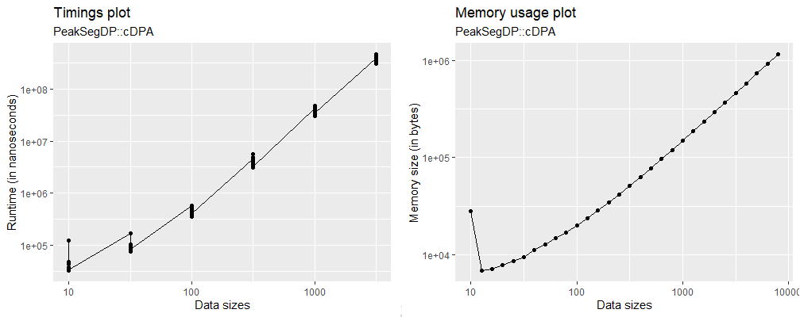
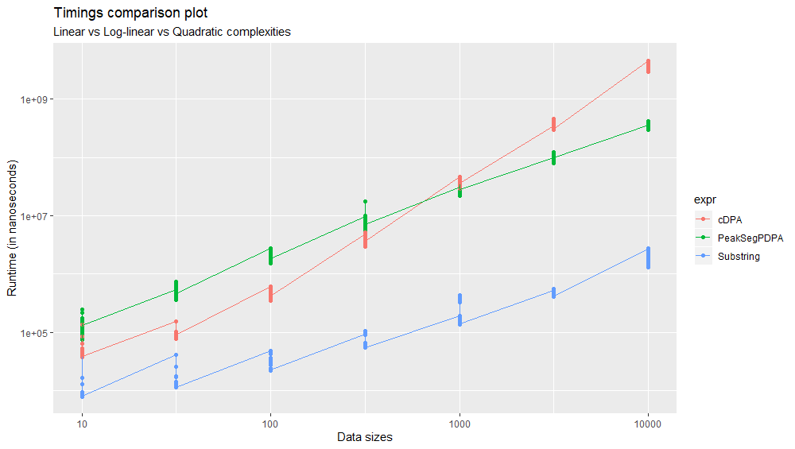
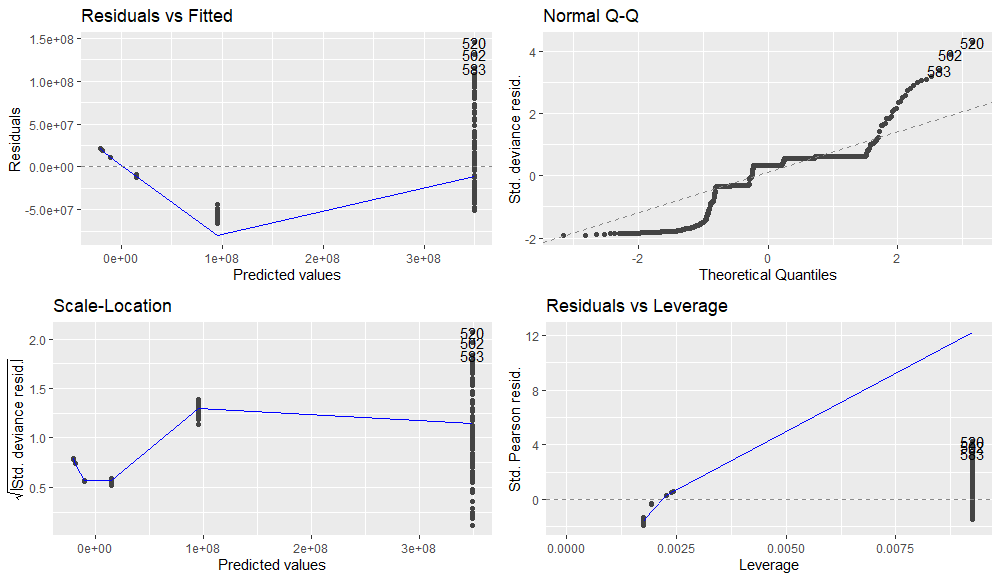

<p align = "center">

</p>

<p align="center">
    <a href="https://rstudio.com/">
        
    <a href="https://git-scm.com/">
    
    <a href="https://www.r-project.org/">
    
    <a href="https://summerofcode.withgoogle.com/projects/#4887653356404736">
    
    <a href="https://github.com/Anirban166/testComplexity/blob/master/LICENSE.md">
           
</p> 

<p align="center">
    <a href="https://www.repostatus.org/#active">
    
    <a href="https://travis-ci.com/github/Anirban166/testComplexity">
          
    <a href="https://codecov.io/gh/Anirban166/testComplexity?branch=master">    
    
    <a href="https://www.codacy.com/manual/bloodraven166/testComplexity?utm_source=github.com&amp;utm_medium=referral&amp;utm_content=Anirban166/testComplexity&amp;utm_campaign=Badge_Grade">
    
    <a href="https://www.tidyverse.org/lifecycle/#experimental">
    
    <a href="https://www.r-project.org/">
    
    <a href="https://github.com/Anirban166/testComplexity/issues">
    
    <a href="https://github.com/Anirban166/testComplexity/issues?q=is%3Aissue+is%3Aclosed">
    
</p> 
<p align="center">
  <a href="#abstract">Abstract</a> •
  <a href="#objectives">Objectives</a> •
  <a href="#installation">Installation</a> •    
  <a href="#functional-flow">Functional Flow</a> •
  <a href="#usage">Usage</a> • 
  <a href="#plotting">Plotting</a> •     
  <a href="#benchmarking">Benchmarking</a> • 
  <a href="#testing">Testing</a> •     
  <a href="#task-list">Task List</a>
</p>    
        
---
<h2 align="center">
Abstract
</h2>

R package developers currently use ad-hoc tests of asymptotic computational complexity via empirical timings of functions and visual diagnostic plots. However, there is no framework in R for systematically testing the empirical computational complexity of functions, which tends to be a problem because such a testing framework could be essential for identifying big speed gains in R code as well. In response to this, **testComplexity** provides a suite of [functions](https://github.com/Anirban166/testComplexity/tree/master/R) that will be useful for testing and thereby improving the speed of various algorithms/functions in R.

<h2 align="center">
Objectives
</h2>

- Primary objectives include classification of an algorithm’s time complexity trends, quantifying the runtimes and plotting the same which helps to visually conceive the complexity results, based upon the initial idea as staged [here](https://github.com/rstats-gsoc/gsoc2020/wiki/Asymptotic-complexity-testing#details-of-your-coding-project). <br>
- Additionally, I thought of covering memory complexity testing as well, which goes hand-in-hand when we are dealing with the term complexity in computer science. <br>
- Furthermore, @tdhock suggested classifying complexity for user-defined output parameters (i.e. a measure of a parameter apart from timings/memory), which would eventually make the package more flexible in terms of use-cases.

Since algorithms are used in every sphere of research, this package potentially caters to all sorts of R-users, following different fields of study. Currently, it is being tested on changepoint detection, constrained optimal segmentation/partitioning algorithms plus a few regular ones such as substring and gregexpr.

<h2 align="center">
Installation
</h2>

Use `devtools` or `remotes` to fetch the package from this repository:
```r
if(!require(devtools)) install.packages("devtools")
devtools::install_github("Anirban166/testComplexity")
```
```r
if(!require(remotes)) install.packages("remotes")
remotes::install_github("Anirban166/testComplexity")
```

<h2 align="center">
Functional Flow
</h2>

```r
__________________ R Files _______________________________________ Additional Details _____________________________
testComplexity                              @ returns              @ type                    @ commit-branch(es) 
├──> asymptoticTimings                    : data.frame             timings quantifier        master
│    ├──> asymptoticTimeComplexityClass   :   ├──> string          ↑ complexity classifier   master
│    └──> plotTimings                     :   └──> ggplot object   ↑ plotter                 master/Plotfunc
│
├──> asymptoticMemoryUsage                : data.frame             memory-usage quantifier   Memtest
│    ├──> asymptoticMemoryComplexityClass :   ├──> string          ↑ complexity classifier   Memtest
│    └──> plotMemoryUsage                 :   └──> ggplot object   ↑ plotter                 Memtest/Plotfunc
│
├──> asymptoticComplexityClass            : string                 complexity classifier     Generalizedcomplexity
│    └──> asymptoticComplexityClassifier  :   ↑ string             ↑ complexity classifier   Generalizedcomplexity
│
└──> testthat                                                                                All branches
     └──> testsfortestComplexity                                   unit-tester               All branches
____________________________________________________________________________________________________________________
```

<h2 align="center">
Usage
</h2>

For obtaining the benchmarked timings/memory against specified data sizes, pass the required algorithm as a function of `data.sizes` to `asymptoticTimings()`/`asymptoticMemoryUsage()`: <br>
```r
> library(PeakSegOptimal)
> library(data.table)
> df <- asymptoticTimings(PeakSegOptimal::PeakSegPDPA(rpois(data.sizes, 1),rep(1, length(rpois(data.sizes, 1))), 3L), data.sizes = 10^seq(1, 4, by = 0.5))
> data.table(df)
       Timings Data sizes
  1:    318703     10.000
  2:    174002     10.000
  3:    237002     10.000
  4:    197901     10.000
  5:    221702     10.000
 ---                     
596:  90820902   3162.278
597:  99308102   3162.278
598: 102231901   3162.278
599: 118894800   3162.278
600: 118237202   3162.278
```
To estimate the corresponding time/memory complexity class, pass the obtained data frame onto `asymptoticTimeComplexityClass()`/`asymptoticMemoryComplexityClass()`: <br>
```r
> asymptoticTimeComplexityClass(df)
[1] "log-linear"
```
Combine the functions if you only require the complexity class: <br>
```r
> library(PeakSegDP)
> asymptoticTimeComplexityClass(asymptoticTimings(PeakSegDP::cDPA(rpois(data.sizes, 1), rep(1, length(rpois(data.sizes, 1))), 3L), data.sizes = 10^seq(1, 4, by = 0.5))
[1] "quadratic"
```

<h2 align="center">
Plotting
</h2>

- **Single Plots** <br>
For obtaining a visual description of the trend followed between runtimes/memory-usage vs data sizes, simply pass the data frame returned by the quantifying functions to `plotTimings()`/`plotMemoryUsage()` for time/memory cases respectively: <br>
```r
> df.time <- asymptoticTimings(PeakSegDP::cDPA(rpois(data.sizes, 1), rep(1, length(rpois(data.sizes, 1))), 3L), data.sizes = 10^seq(1, 5, by = 0.5))
> df.memory <- asymptoticMemoryUsage(PeakSegDP::cDPA(rpois(data.sizes, 1), rep(1, length(rpois(data.sizes, 1))), 3L), data.sizes = 10^seq(1, 5, by = 0.1))
> plotTimings(df.time, titles = list("Timings plot", "PeakSegDP::cDPA"))
> plotMemoryUsage(df.memory, titles = list("Memory usage plot", "PeakSegDP::cDPA")) 
```
 <br>
- **Comparison Plots** <br>
In order to visually compare different algorithms based on the benchmarked metrics returned as a data frame by the quantifiers, one can appropriately add a third column (to help distinguish by aesthetics based on it) with a unique value for each of the data frames, combine them using an `rbind()` and then plot the resultant data frame using suitable aesthetics, geometry, scale, labels/titles etcetera via a ggplot: <br>
```r
> df.one <- asymptoticTimings(substring(paste(rep("A", data.sizes), collapse = ""), 1:data.sizes, 1:data.sizes), data.sizes = 10^seq(1, 4, by = 0.5))
> asymptoticTimeComplexityClass(df.one)
[1] "linear"
> df.two <- asymptoticTimings(PeakSegOptimal::PeakSegPDPA(rpois(data.sizes, 1),rep(1, length(rpois(data.sizes, 1))), 3L), data.sizes = 10^seq(1, 4, by = 0.5), max.seconds = 1)
> asymptoticTimeComplexityClass(df.two)
[1] "log-linear"
> df.three <- asymptoticTimings(PeakSegDP::cDPA(rpois(data.sizes, 1), rep(1, length(rpois(data.sizes, 1))), 3L), data.sizes = 10^seq(1, 4, by = 0.5), max.seconds = 5)
> asymptoticTimeComplexityClass(df.three)
[1] "quadratic"
> df.one$expr = "Substring"
> df.two$expr = "PeakSegPDPA"
> df.three$expr = "cDPA"
> plot.df <- rbind(df.one, df.two, df.three)
> ggplot(plot.df, aes(x = `Data sizes`, y = Timings)) + geom_point(aes(color = expr)) + geom_line(aes(color = expr)) + labs(x = "Data sizes", y = "Runtime (in nanoseconds)") + scale_x_log10() + scale_y_log10() + ggtitle("Timings comparison plot", subtitle = "Linear vs Log-linear vs Quadratic complexities")
```
 <br>
- **Diagnostic Plots** <br>
`ggfortify`, an extension of `ggplot2`, can be used to produce diagnostic plots for generalized linear models with the same formulae as used in the complexity classification functions: <br>
```r
> library(ggfortify)
> df <- asymptoticTimings(PeakSegDP::cDPA(rpois(data.sizes, 1), rep(1, length(rpois(data.sizes, 1))), 3L), data.sizes = 10^seq(1, 5, by = 0.5))
> glm.plot.obj <- glm(Timings~`Data sizes`, data = df)
> ggplot2::autoplot(stats::glm(glm.plot.obj))
```
 <br>

<h2 align="center">
Benchmarking
</h2>

Among a few [options](https://anirban166.github.io//Benchmarking/), 
- `microbenchmark::microbenchmark()` is used to compute the benchmarks to obtain the time results in `testComplexity::asymptoticTimings()`, for the added convenience of having the benchmarked results as a data frame plus for the precision or time scale it produces the results on. (usually in nanoseconds, as can be found from [here](https://cran.r-project.org/web/packages/microbenchmark/microbenchmark.pdf)) <br>
- `bench::bench_memory()` is used to compute the allocated memory size in order to obtain the memory use metrics in `testComplexity::asymptoticMemoryUsage()`. <br>
            
<h2 align="center">
Testing
</h2>

- **Functions** <br>
Current set of functions taken into consideration for testing our functionality: 
```r
# packages:             # functions:
library(PeakSegDP)      # cDPA()
library(PeakSegDisk)    # PeakSegFPOP_vec()
library(PeakSegOptimal) # PeakSegPDPA(), PeakSegFPOP()
library(fpop)           # fpop()
library(gfpop)          # gfpop()
library(opart)          # opart_gaussian()
library(changepoint)    # cpt.mean()
```
A complexity-wise ordered list with functional instances for the aforementioned set of functions can be found [here](https://github.com/Anirban166/testComplexity/issues/2#issue-615087634). <br>
- **Unit Testing** <br>
Test cases for testComplexity functions via [testthat](https://cran.r-project.org/web/packages/testthat/index.html) package can be found [here](https://github.com/Anirban166/testComplexity/blob/master/tests/testthat/test-testsfortestComplexity.R). <br>
- **Code Coverage** <br>
Tested locally by `covr::package_coverage()` and codecov, with 100% code coverage. <br>
- **OS Support** <br>
Travis-CI builds are tested on Linux machines, whereas Windows is the native OS this package is developed and tested on. <br>
Note that the use of `bench::bench_memory` overcomes the drawback of windows-only OS limitation for memory complexity testing in `GuessCompx::CompEst` as it successfully runs on other operating systems such as Linux. Although not tested yet, the existing functionality should safely run in MacOS as well, since [`bench`](https://cran.r-project.org/web/packages/bench/bench.pdf) uses corresponding memory extraction APIs for all the three major operating systems.
<p align="center">
<a href="https://www.microsoft.com/en-in/windows">  <a href="https://www.linux.org/">  
</p> 

<h2 align="center">
Task List
</h2>

- [x] Time complexity testing.
- [x] Memory complexity testing.
- [x] Classification of user given output (output size is the metric, instead of timings/memory-usage) parameter.
- [ ] Add testing functions, with optional packages as suggests.

---
<h2 align="center">
Anirban166 © 2020
</h2>

<p align="center">
    <a href="mailto:bloodraven166@gmail.com"> 
          
    <a href="https://stackoverflow.com/users/11422223/anirban166?tab=profile">    
    
    <a href="https://www.hackerrank.com/Bloodraven166">
    
    <a href="https://www.instagram.com/anirban.166/">
        
    <a href="https://summerofcode.withgoogle.com/projects/4887653356404736"> 
       
    <a href="mailto:Anirban.code@studentpartner.com">
                
    <a href="https://github.com/Anirban166">
      
    <a href="https://anirban166.github.io/posts/">
    
    <a href="https://www.linkedin.com/in/anirban166/">
    
    <a href="https://anirban166.github.io/">
            
</p> 
