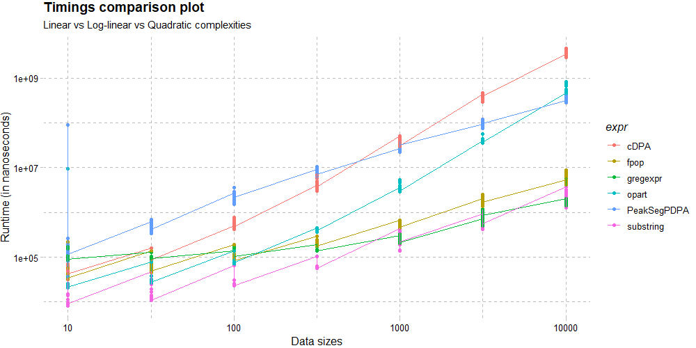

<p align = "center">

</p>

<p align="center">
    <a href="https://github.com/Anirban166/testComplexity/actions">
        
    <a href="https://travis-ci.com/github/Anirban166/testComplexity">
          
    <a href="https://codecov.io/gh/Anirban166/testComplexity?branch=master">    
     
    <a href="https://www.codacy.com/manual/bloodraven166/testComplexity?utm_source=github.com&amp;utm_medium=referral&amp;utm_content=Anirban166/testComplexity&amp;utm_campaign=Badge_Grade">
     
    <a href="https://www.r-project.org/">
     
    <a href="https://summerofcode.withgoogle.com/archive/2020/projects/5767451238727680/">
    
    <a href="https://github.com/Anirban166/testComplexity/blob/master/LICENSE.md">
     </a>      
</p> 

| <a href="#abstract">Abstract</a> | <a href="#objectives">Objectives</a> | <a href="#installation">Installation</a> | <a href="#functional-flow">Functions</a> | <a href="#usage">Usage</a> | <a href="#plotting">Plotting</a> | <a href="#benchmarking">Benchmarking</a> | <a href="#testing">Testing</a> | <a href="#resources">Resources</a> |
|---|---|---|---|---|---|---|---|---|
        
---
<h2 align="center">
Abstract
</h2>

R package developers currently use ad-hoc tests of asymptotic computational complexity via empirical timings of functions and visual diagnostic plots. However, there is no framework in R for systematically testing the empirical computational complexity of functions, which tends to be a problem because such a testing framework could be essential for identifying big speed gains in R code as well. In response to this, **testComplexity** provides a suite of [functions](https://github.com/Anirban166/testComplexity/tree/master/R) that will be useful for testing and thereby improving the speed of various algorithms/functions in R.

<h2 align="center">
Objectives
</h2>

- Primary objectives include quantification of runtimes for an algorithm/function (against a set of user-provided data sizes), classification of the corresponding asymptotic time complexity class it belongs to (based on the computed benchmarks) and testing for the same against an expected time complexity class for verification of empirically observed results, based upon the initial idea as staged [here](https://github.com/rstats-gsoc/gsoc2020/wiki/Asymptotic-complexity-testing#details-of-your-coding-project). <br>
- As per my proposal, a simple plot functionality was incorporated which helps to visually diagnose/conceive the benchmarked results. Additionally, I thought of covering memory complexity testing as well, which goes hand-in-hand when we are dealing with the term complexity in computer science. <br>
- Furthermore, [@tdhock](https://github.com/tdhock) suggested classifying complexity for user-defined output parameters (i.e. a measure of a parameter apart from timings/memory), which would eventually make the package more flexible in terms of use-cases.

Since algorithms are used in every sphere of research, this package potentially caters to all sorts of R-users, following different fields of study/research. At its current state, it has been tested on algorithms pertaining to changepoint detection, sorting, constrained optimal segmentation/partitioning, plus a few common ones from base R such as substring and gregexpr.

<h2 align="center">
Installation
</h2>

Use `devtools` or `remotes` to fetch the package from this repository:
```r
if(!require(devtools)) install.packages("devtools")
devtools::install_github("Anirban166/testComplexity")
```
```r
if(!require(remotes)) install.packages("remotes")
remotes::install_github("Anirban166/testComplexity")
```
Alternatively, opt for the CRAN-stable version using:
```r
install.packages("testComplexity")
```

<h2 align="center">
Functional Flow
</h2>

```r
__________________ R Files _______________________________________ Additional Details _____________________________
testComplexity                              @ returns              @ type                    @ commit-branch(es) 
├──> asymptoticTimings                    : data.frame             timings quantifier        master
│    ├──> asymptoticTimeComplexityClass   :   ├──> string          ↑ complexity classifier   master
│    └──> plotTimings                     :   └──> ggplot object   ↑ plotter                 master/Plotfunc
│
├──> asymptoticMemoryUsage                : data.frame             memory-usage quantifier   Memtest
│    ├──> asymptoticMemoryComplexityClass :   ├──> string          ↑ complexity classifier   Memtest
│    └──> plotMemoryUsage                 :   └──> ggplot object   ↑ plotter                 Memtest/Plotfunc
│
├──> asymptoticComplexityClass            : string                 complexity classifier     Generalizedcomplexity
│    └──> asymptoticComplexityClassifier  :   ↑ string             ↑ complexity classifier   Generalizedcomplexity
│
├──> expect_complexity_class              : -/-                    test function             Testfunc
│    └──> expect_time_complexity          : -/-                    ↑  test function          Testfunc
│         ├──> expect_linear_time         : -/-                    ↑↑ test function          Testfunc
│         ├──> expect_loglinear_time      : -/-                    ↑↑ test function          Testfunc
│         └──> expect_quadratic_time      : -/-                    ↑↑ test function          Testfunc
│
└──> testthat                                                                                
     ├──> testsfortestComplexity                                   unit-tester               All branches
     ├──> testsforConstrainedchangepointmodelalgos                 unit-tester               Testfunc
     └──> testsforRegularfunctions                                 unit-tester               Testfunc
____________________________________________________________________________________________________________________
```

<h2 align="center">
Usage
</h2>

To get started, please check the [general vignette](https://anirban166.github.io/testComplexity/articles/testComplexity.html) which highlights all the features, enlists the different types of function categories existent in the package and describes the functionality offered by the underlying user-oriented functions via a set of textual elucidations with one example taken to be discussed throughout for each of them. 

For a quick overview of the main functionality (obtaining quantified benchmarks & subsequently computing the time/memory complexity class), please check the examples below.

- To obtain the benchmarked timings/memory-allocations against specified data sizes, pass the required algorithm as a function of `N` to `asymptoticTimings()`/`asymptoticMemoryUsage()`: <br>
```r
> library(data.table)
# Example 1 | Applying the bubble sort algorithm to a sample of 100 elements: (expected quadratic time complexity & constant memory complexity)
# Code for bubble.sort and other sorting algorithms can be found in my contributions to TheAlgorithms/R repo : https://github.com/TheAlgorithms/R/tree/master/sorting
> df.bubble.time <- asymptoticTimings(bubble.sort(sample(1:100, N, replace = TRUE)), data.sizes = 10^seq(1, 3, by = 0.5))
> data.table(df.bubble.time)
      Timings Data sizes
  1:    91902         10
  2:    39402         10
  3:    34701         10
  4:    33101         10
  5:    33201         10
 ---                    
496: 64490501       1000
497: 59799101       1000
498: 63452200       1000
499: 62807201       1000
500: 59757102       1000
> df.bubble.memory <- asymptoticMemoryUsage(bubble.sort(sample(1:100, N, replace = TRUE)), data.sizes = 10^seq(1, 3, by = 0.1))
> data.table(df.bubble.memory)
    Memory usage Data sizes
 1:        87800   10.00000
 2:         2552   12.58925
 3:         2552   15.84893
 4:         2552   19.95262
 5:         2552   25.11886
 ---                    
17:         7472  398.10717
18:         8720  501.18723
19:        10256  630.95734
20:        12224  794.32823
21:        14696 1000.00000
```
```r
# Example 2 | Testing PeakSegPDPA, an algorithm for constrained changepoint detection: (expected log-linear time and memory complexity)
> data.vec <- rpois(N, 1)
> df.PDPA.time <- asymptoticTimings(PeakSegOptimal::PeakSegPDPA(count.vec = data.vec, max.segments = 3L), data.sizes = 10^seq(1, 4, by = 0.1))
> data.table(df.PDPA.time)
       Timings Data sizes
  1:    248701         10
  2:    120302         10
  3:    125701         10
  4:    133301         10
  5:    146500         10
 ---                     
696: 405597501      10000
697: 408335001      10000
698: 338544401      10000
699: 404081901      10000
700: 399575501      10000
> df.PDPA.memory <- asymptoticMemoryUsage(PeakSegOptimal::PeakSegPDPA(count.vec = data.vec, max.segments = 3L), data.sizes = 10^seq(1, 4, by = 0.1))
> data.table(df.PDPA.memory)
    Memory usage Data sizes
 1:         6256   10.00000
 2:         7024   12.58925
 3:         7432   15.84893
 4:         8560   19.95262
 5:         9496   25.11886
 --- 
25:       447792 2511.88643
26:       562336 3162.27766
27:       706512 3981.07171
28:       887792 5011.87234
29:      1116240 6309.57344
```
- To estimate the corresponding time/memory complexity class, pass the obtained data frame onto `asymptoticTimeComplexityClass()`/`asymptoticMemoryComplexityClass()`: <br>
```r
# Example 1 | Applying the bubble sort algorithm to a sample of 100 elements: (expected quadratic time complexity & constant memory complexity)
> asymptoticTimeComplexityClass(df.bubble.time)
[1] "quadratic"
> asymptoticMemoryComplexityClass(df.bubble.memory)
[1] "constant"
```
```r
# Example 2 | Testing PeakSegPDPA, an algorithm for constrained changepoint detection: (expected log-linear time and memory complexity)
> asymptoticTimeComplexityClass(df.PDPA.time)
[1] "loglinear"
> asymptoticMemoryComplexityClass(df.PDPA.memory)
[1] "loglinear"
```
- Combine the functions if you only require the complexity class: <br>
```r
# Example 3 | Testing the time complexity of quick sort algorithm: (expected log-linear time complexity)
> asymptoticTimeComplexityClass(asymptoticTimings(sort(sample(1:100, N, replace = TRUE), method = "quick" , index.return = TRUE), data.sizes = 10^seq(1, 3, by = 0.5)))
[1] "loglinear"
```
```r
# Example 4 | Allocating a square matrix (N*N dimensions): (expected quadratic memory complexity)
> asymptoticMemoryComplexityClass(asymptoticMemoryUsage(matrix(data = N:N, nrow = N, ncol = N), data.sizes = 10^seq(1, 3, by = 0.1)))
[1] "quadratic"
```
Check [this screencast](https://youtu.be/H4uefLb8zcQ) for a demonstration of time complexity testing on different sorting algorithms over a test session.
For more examples with functions from specific packages, please check the table with relevant contents in the [testing section](#testing).

<h2 align="center">
Plotting
</h2>

For obtaining a visual description of the trend followed between runtimes/memory-usage vs data sizes so as to diagnose the complexity result(s), simple plots can be crafted. They are roughly grouped into: 

- **Single Plots** <br>
Individual plots can be obtained by passing the data frame returned by the quantifying functions to `plotTimings()`/`plotMemoryUsage()` for time/memory cases respectively: <br>
```r
# Timings plot for PeakSegDP::cDPA
> df <- asymptoticTimings(PeakSegDP::cDPA(rpois(N, 1), rep(1, length(rpois(N, 1))), 3L), data.sizes = 10^seq(1, 4))
> plotTimings(df.time, titles = list("Timings", "PeakSegDP::cDPA"), line.color = "#ffec1b", point.color = "#ffec1b", line.size = 1, point.size = 1.5)
# Equivalent ggplot object:
df <- asymptoticTimings(PeakSegDP::cDPA(rpois(data.sizes, 1), rep(1, length(rpois(data.sizes, 1))), 3L), data.sizes = 10^seq(1, 4))
> ggplot(df, aes(x = `Data sizes`, y = Timings)) + geom_point(color = ft_cols$yellow, size = 1.5) + geom_line(color = ft_cols$yellow, size = 1) + labs(x = "Data sizes", y = "Runtime (in nanoseconds)") + scale_x_log10() + scale_y_log10() + ggtitle("Timings", "PeakSegDP::cDPA") + hrbrthemes::theme_ft_rc()
```
```r
# Memory Usage plot for PeakSegDP::cDPA
> df <- asymptoticMemoryUsage(PeakSegDP::cDPA(rpois(N, 1), rep(1, length(rpois(N, 1))), 3L), data.sizes = 10^seq(1, 6, by = 0.1))
> plotMemoryUsage(df.memory, titles = list("Memory Usage", "PeakSegDP::cDPA"), line.color = "#ffec1b", point.color = "#ffec1b", line.size = 1, point.size = 2) 
# Equivalent ggplot object:
> ggplot(df, aes(x = `Data sizes`, y = `Memory usage`)) + geom_point(color = ft_cols$yellow, size = 2) + geom_line(color = ft_cols$yellow, size = 1) labs(x = "Data sizes", y = "Memory usage (in bytes)") + scale_x_log10() + scale_y_log10() + ggtitle("Memory Usage", "PeakSegDP::cDPA") + hrbrthemes::theme_ft_rc()
```
 <br>
- **Comparison Plots** <br>
In order to visually compare different algorithms based on the benchmarked metrics returned as a data frame by the quantifiers, one can appropriately add a third column (to help distinguish by aesthetics based on it) with a unique value for each of the data frames, combine them using an `rbind()` and then plot the resultant data frame using suitable aesthetics, geometry, scale, labels/titles etcetera via a ggplot: <br>
```r
> df.substring <- asymptoticTimings(substring(paste(rep("A", N), collapse = ""), 1:N, 1:N), data.sizes = 10^seq(1, 4, by = 0.5))
> asymptoticTimeComplexityClass(df.substring)
[1] "linear"
> df.PeakSegPDPA <- asymptoticTimings(PeakSegOptimal::PeakSegPDPA(rpois(N, 1),rep(1, length(rpois(N, 1))), 3L), data.sizes = 10^seq(1, 4, by = 0.5), max.seconds = 1)
> asymptoticTimeComplexityClass(df.PeakSegPDPA)
[1] "loglinear"
> df.cDPA <- asymptoticTimings(PeakSegDP::cDPA(rpois(N, 1), rep(1, length(rpois(N, 1))), 3L), data.sizes = 10^seq(1, 4, by = 0.5), max.seconds = 5)
> asymptoticTimeComplexityClass(df.cDPA)
[1] "quadratic"
> df.gregexpr <- asymptoticTimings(gregexpr("a", paste(collapse = "", rep("ab", N)), perl = TRUE), data.sizes = 10^seq(1, 4, by = 0.5))
> asymptoticTimeComplexityClass(df.gregexpr)
[1] "linear"
> df.fpop <- asymptoticTimings(fpop::Fpop(rnorm(N), 1), data.sizes = 10^seq(1, 4, by = 0.5))
> asymptoticTimeComplexityClass(df.fpop)
[1] "loglinear"
> df.opart <- asymptoticTimings(opart::opart_gaussian(rnorm(N), 1), data.sizes = 10^seq(1, 4, by = 0.5))
> asymptoticTimeComplexityClass(df.opart)
[1] "quadratic"
> df.substring$expr = "substring"
> df.PeakSegPDPA$expr = "PeakSegPDPA"
> df.cDPA$expr = "cDPA"
> df.gregexpr$expr = "gregexpr"
> df.fpop$expr = "fpop"
> df.opart$expr = "opart"
> plot.df <- rbind(df.substring, df.PeakSegPDPA, df.cDPA, df.gregexpr, df.fpop, df.opart)
> ggplot(plot.df, aes(x = `Data sizes`, y = Timings)) + geom_point(aes(color = expr)) + geom_line(aes(color = expr)) + labs(x = "Data sizes", y = "Runtime (in nanoseconds)") + scale_x_log10() + scale_y_log10() + ggtitle("Timings comparison plot", subtitle = "Linear vs Log-linear vs Quadratic complexities") + ggthemes::theme_pander()
```
 <br>

Feel free to include more functions and increase the number of data sizes for a more comprehensive outlook: <br>

 <br>
- **Generalized Linear Model based Plots** <br>
`ggfortify`, an extension of `ggplot2`, can be used to produce diagnostic plots for generalized linear models with the same formulae as used in the complexity classification functions: <br>
```r
> library(ggfortify)
> df <- asymptoticTimings(PeakSegDP::cDPA(rpois(N, 1), rep(1, length(rpois(N, 1))), 3L), data.sizes = 10^seq(1, 4 by = 0.1))
> glm.plot.obj <- glm(Timings~`Data sizes`, data = df)
> ggplot2::autoplot(stats::glm(glm.plot.obj)) + ggthemes::theme_gdocs()
```
 <br>

<h2 align="center">
Benchmarking
</h2>

Among a few [options](https://anirban166.github.io//Benchmarking/), 
- `microbenchmark::microbenchmark()` is used to compute the benchmarks to obtain the time results in `testComplexity::asymptoticTimings()`, for the added convenience of having the benchmarked results as a data frame plus for the precision or time scale it produces the results on. (usually in nanoseconds, as can be found from [here](https://cran.r-project.org/web/packages/microbenchmark/microbenchmark.pdf)) <br>
- `bench::bench_memory()` is used to compute the allocated memory size in order to obtain the memory use metrics in `testComplexity::asymptoticMemoryUsage()`. <br>
            
<h2 align="center">
Testing
</h2>

- **Functions** <br>
Current set of functions taken into consideration for testing our functionality, plus a dedicated vignette-based article for each can be found below:  

| Source Package | Function | Article Link |
|----------------|----------|--------------|
| base           | gregexpr    | [Quadratic to linear transition for substring and gregexpr](https://anirban166.github.io/testComplexity/articles/substring_and_gregexpr.html) |
| base           | substring   | [Quadratic to linear transition for substring and gregexpr](https://anirban166.github.io/testComplexity/articles/substring_and_gregexpr.html) |
| fpop           | Fpop        | [fpop::Fpop(), a log-linear time segmentation algorithm](https://anirban166.github.io/testComplexity/articles/fpop.html) |
| gfpop          | gfpop       | [gfpop::gfpop(), a log-linear time algorithm for constrained changepoint detection](https://anirban166.github.io/testComplexity/articles/gfpop.html) |
| opart          | gaussian    | [opart::gaussian(), a quadratic time optimal partioning algorithm](https://anirban166.github.io/testComplexity/articles/opart.html) |
| PeakSegDP      | cDPA        | [PeakSegDP::cDPA, a quadratic time constrained dynamic programming algorithm](https://anirban166.github.io/testComplexity/articles/cDPA.html) |
| changepoint    | cpt.mean    | [PELT and SegNeigh algorithms for changepoint::cpt.mean()](https://anirban166.github.io/testComplexity/articles/PELT_and_SegNeigh.html) |
| PeakSegOptimal | PeakSegPDPA | [PeakSegOptimal::PeakSegPDPA, a log-linear time algorithm for constrained changepoint detection](https://anirban166.github.io/testComplexity/articles/PeakSegPDPA.html) |

A complexity-wise ordered list with functional instances for the aforementioned set of functions can be found [here](https://github.com/Anirban166/testComplexity/issues/2#issue-615087634). <br>
- **Unit Testing** <br>
Test cases for testComplexity functions via [testthat](https://cran.r-project.org/web/packages/testthat/index.html) package can be found [here](https://github.com/Anirban166/testComplexity/blob/master/tests/testthat/test-testsfortestComplexity.R). <br>
- **Code Coverage** <br>
Tested locally by `covr::package_coverage()` and codecov, with [100% code coverage](https://codecov.io/gh/Anirban166/testComplexity?branch=master). <br>
- **OS Support** <br>
Travis-CI builds are tested on Linux machines, whereas Windows is the native OS this package is developed and tested on. In addition to both, RCMD checks are run on MacOS as well. <br>
Note that the use of `bench::bench_memory()` overcomes the drawback of windows-only OS limitation for memory complexity testing as observed in `GuessCompx::CompEst()` since it successfully runs on other operating systems. <br>

<p align="center">
<a href="https://www.microsoft.com/en-in/windows">  <a href="https://www.linux.org/">  <a href="https://developer.apple.com/macos/">  </a>
</p> 

<h2 align="center">
Resources
</h2>

In addition to the readme content, the [web version](https://anirban166.github.io/testComplexity/) includes quick [reference](https://anirban166.github.io/testComplexity/reference/index.html) to functions plus vignettes for some use-cases. For [blog](https://anirban166.github.io/posts/) posts, please check the links below: <br>

<p align="center">
<a href="https://anirban166.github.io//Test-functions/">  
<a href="https://anirban166.github.io//Timings-quantifying-function/">  
<a href="https://anirban166.github.io//Memory-usage-quantifier/">  
<a href="https://anirban166.github.io//Complexity-classifiers/">  
<a href="https://anirban166.github.io//Plotters/">  </a> <br>
<a href="https://anirban166.github.io//Generalized-complexity/"> 
<a href="https://anirban166.github.io//Testing-functions/">  
<a href="https://anirban166.github.io//Website/">  
<a href="https://anirban166.github.io//Software-Development/">  
<a href="https://anirban166.github.io//GSoC-2020-Summary/">  <br>
</p>
    
---
<h2 align="center">
©2020
</h2>

<p align="center">
    <a href="mailto:bloodraven166@gmail.com"> 
          
    <a href="https://stackoverflow.com/users/11422223/anirban166?tab=profile">    
    
    <a href="https://www.hackerrank.com/Anirban166">
    
    <a href="https://www.instagram.com/anirban.166/">
        
    <a href="https://summerofcode.withgoogle.com/projects/4887653356404736"> 
       
    <a href="mailto:Anirban.code@studentambassadors.com">
                
    <a href="https://github.com/Anirban166">
      
    <a href="https://anirban166.github.io/posts/">
    
    <a href="https://www.linkedin.com/in/anirban166/">
    
    <a href="https://anirban166.github.io/">
            
</p> 
